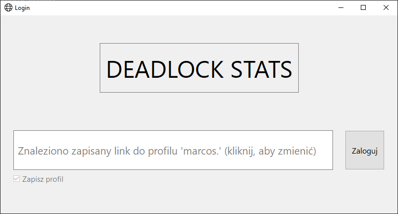
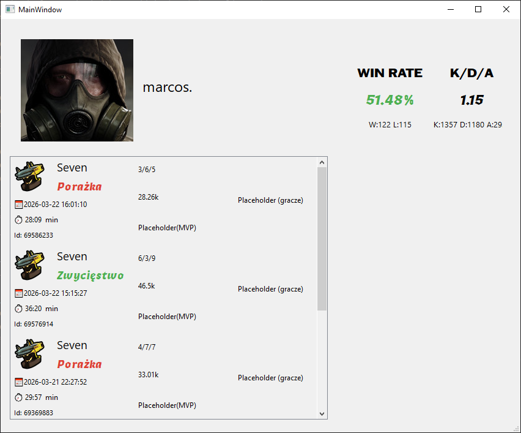

# Deadlock Stats

Aplikacja desktopowa służąca do śledzenia i analizowania statystyk graczy w grze **Deadlock**. Projekt został stworzony w języku Python z wykorzystaniem biblioteki PyQt, oferując przejrzysty interfejs użytkownika oraz integrację z danymi Steam.

## 📸 Zrzuty ekranu

| Ekran Logowania | Statystyki Gracza |
| :---: | :---: |
|  |  |

##  Funkcje

* **Integracja ze Steam:** Pobieranie publicznych danych profilu za pomocą Steam XML API.
* **Przegląd Profilu:** Szybki podgląd ogólnych statystyk gracza.
* **Szczegółowe Statystyki:** Analiza wyników ostatnich meczów.

### Projekt stworzony w celach hobbystycznych
